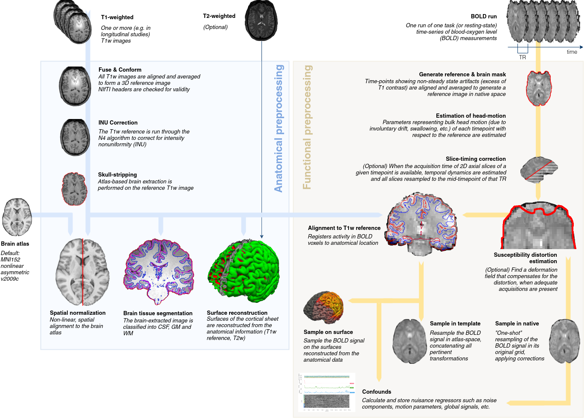

# HCP-fmriprep

[fmriprep](https://www.nature.com/articles/s41592-018-0235-4) is an suscesfull tool to preprocessing fmri data before statistical analysis developed by the Poldrack lab. This tool performs a bunch of steps from differents softwares such as coregistration, normalization, unwarping, noise component extraction, segmentation, skullstripping, etc. Please check the main page to more information [Go to fmriprep](https://fmriprep.org/en/stable/)



## How to run it 🚀

You can run fmriprep by installing in your computer through python pip, however, you also have to install all the [dependencies to run it](https://fmriprep.org/en/stable/installation.html#external-dependencies)

```
python -m pip install fmriprep
```

However, we strongly recommend to run it using a container ([Docker](https://www.docker.com/) or [Singularity](https://sylabs.io/docs/)). In here, we going to use Singularity to run it in a HCP cluster (Ada-lavis in UNAM). To see what a container is, please check: https://www.docker.com/resources/what-container


### Requirements 📋

We firstly need to create a singularity container from fmriprep. We can copy from the docker container at https://hub.docker.com/r/poldracklab/fmriprep/ and create the singularity one by run the follow command on a terminal in the location of your preference.

```
singularity build fmriprep_v20.sif docker://poldracklab/fmriprep
```

This will create the container file (.sif) with all the dependencies needed

## Configuration before run 🔧

### BIDS format

Remenber, fmriprep requires that the input data are organized according to the [BIDS standard](https://bids.neuroimaging.io/). Please check https://github.com/psilantrolab/Documentation/wiki/Dicom-to-BIDS to check how to convert files in the format.
```
data/bids/
├── CHANGES
├── dataset_description.json
├── LICENSE
├── participants.json
├── participants.tsv
├── README
├── README.md
├── sub-001
│   ├── anat
│   │   ├── sub-001_T1w.json
│   │   └── sub-001_T1w.nii.gz
│   ├── fmap
│   │   ├── sub-001_dir-PA_epi.json
│   │   └── sub-001_dir-PA_epi.nii.gz
│   └── func
│       ├── sub-001_task-rest_bold.json
│       └── sub-001_task-rest_bold.nii.gz
├── sub-002
│   ├── anat
│   │   ├── sub-002_T1w.json
│   │   └── sub-002_T1w.nii.gz
│   ├── fmap
│   │   ├── sub-002_dir-PA_epi.json
│   │   └── sub-002_dir-PA_epi.nii.gz
│   └── func
│       ├── sub-002_task-rest_bold.json
│       └── sub-002_task-rest_bold.nii.gz
```

### Preparing the environment 

In an HCP cluster like ADA, you could 

## Now we can run it ⚙️

### Single subject run


### Run it in a loop cycle


## Output 🔩 📦


## Wiki 📖

You can find more information and others tutorials at [PSILANTRO](https://github.com/psilantrolab/Documentation/wiki/)

## Other Links  ✒️


